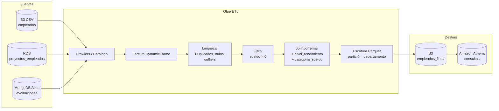

# Informe ETL: Repositorio analítico de empleados

**Empresa de informática – Pipeline ETL con AWS Glue**

---

## Resumen

Se ha diseñado y ejecutado un pipeline ETL con AWS Glue para integrar datos de empleados desde **tres fuentes** (archivos CSV en S3, base de datos RDS y MongoDB Atlas), aplicar **limpieza y filtrado**, realizar el **join** por `email` y generar un **dataset final** particionado en S3, consultable con **Amazon Athena**.

---

## Paso 1. Almacenamiento inicial en S3

### Objetivo
Crear el bucket y la estructura de carpetas donde se almacenarán los datos de entrada y salida del ETL.

### Acciones realizadas
- Creación de un bucket en Amazon S3 (por ejemplo: `empresa-analitica-datos`).
- Estructura de carpetas:
  - `s3://bucket/raw/empleados/` → CSV de empleados (nombre, email, departamento, puesto, sueldo, antigüedad).
  - `s3://bucket/raw/` (opcional) para otros archivos.
  - `s3://bucket/analitica/empleados_final/` → Salida del ETL (Parquet particionado por departamento).

### Criterio de evaluación
- **Bucket y estructura creados correctamente.**  
- **CSV cargado sin errores** en la ruta prevista (p. ej. `raw/empleados/empleados.csv`).

### Captura de pantalla (placeholder)
*Inserte aquí una captura del bucket S3 mostrando la estructura de carpetas y el archivo `empleados.csv`.*

---

## Paso 2. Base de datos en el catálogo

### Objetivo
Crear la base de datos en el **AWS Glue Data Catalog** que contendrá las tablas detectadas por los Crawlers (S3, RDS y MongoDB).

### Acciones realizadas
- En **AWS Glue Console** → **Databases** → **Add database**.
- Nombre: `empresa_db`.
- Descripción: “Base de datos del repositorio analítico de empleados”.

### Criterio de evaluación
- **Base de datos empresa_db creada correctamente en Glue.**

### Captura de pantalla (placeholder)
*Inserte aquí una captura de la consola de Glue mostrando la base de datos `empresa_db` en la lista de Databases.*

---

## Paso 3. Crawler para S3

### Objetivo
Crear y ejecutar un **Crawler** que lea el CSV de empleados en S3 y registre una **tabla** en el catálogo con los campos: nombre, email, departamento, puesto, sueldo, antigüedad.

### Acciones realizadas
- **Crawlers** → **Create Crawler**.
- Data source: ruta S3 del CSV (p. ej. `s3://bucket/raw/empleados/`).
- IAM role con permisos sobre S3 y Glue.
- Output: base de datos `empresa_db`, tabla generada (p. ej. `empleados`).
- Ejecución del Crawler y comprobación de que la tabla tiene todos los campos.

### Criterio de evaluación
- **Crawler ejecutado correctamente, tabla detectada con todos los campos.**

### Campos esperados en la tabla
| Campo       | Tipo   |
|------------|--------|
| nombre     | string |
| email      | string |
| departamento | string |
| puesto     | string |
| sueldo     | int/long |
| antigüedad | int/long |

### Captura de pantalla (placeholder)
*Inserte captura del Crawler (configuración o ejecución) y de la tabla `empleados` en el Data Catalog mostrando las columnas.*

---

## Paso 4. Source para la base de datos RDS

### Objetivo
Configurar el acceso a la base de datos **RDS** (MySQL/PostgreSQL) como fuente del ETL: tabla con email, proyecto, horas_trabajadas, rol.

### Acciones realizadas
- Crear **Conexión** en Glue (tipo JDBC) con la URL, usuario y contraseña del RDS.
- Crear un **Crawler** que use esta conexión y apunte al esquema/tabla donde está `proyectos_empleados`.
- El Crawler registra la tabla en `empresa_db` (p. ej. `proyectos_empleados`).

### Criterio de evaluación
- **Conexión y Crawler configurados correctamente, tabla registrada sin errores.**

### Estructura tabla RDS (proyectos_empleados)
| Campo            | Tipo   |
|------------------|--------|
| email            | string |
| proyecto         | string |
| horas_trabajadas | int    |
| rol              | string |

### Captura de pantalla (placeholder)
*Inserte captura de la conexión JDBC a RDS y de la tabla `proyectos_empleados` en el catálogo.*

---

## Paso 5. Conexión a MongoDB Atlas

### Objetivo
Conectar **MongoDB Atlas** como fuente del ETL: colección con email, rendimiento, feedback_ultimo_mes, fecha_ultima_evaluacion.

### Acciones realizadas
- En MongoDB Atlas: obtener **connection string** y configurar red (IP del VPC de Glue o 0.0.0.0/0 para pruebas).
- En Glue: **Connections** → crear conexión tipo **MongoDB** con el connection string.
- Opcional: Crawler sobre la colección para registrar la “tabla” en el catálogo; o leer directamente desde el Job con la conexión MongoDB.

### Criterio de evaluación
- **Conexión establecida y Crawler (o Job) registra/lee la colección correctamente.**

### Estructura documento MongoDB (evaluaciones)
| Campo                     | Tipo   |
|---------------------------|--------|
| email                     | string |
| rendimiento               | string |
| feedback_ultimo_mes       | string |
| fecha_ultima_evaluacion   | string |

### Captura de pantalla (placeholder)
*Inserte captura de la conexión MongoDB en Glue y de la colección/tabla en el catálogo (si aplica).*

---

## Paso 6. Creación del ETL Job

### Objetivo
Crear el **Glue ETL Job** que lee las tres fuentes (S3, RDS, MongoDB), aplica limpieza, filtrado, join y escribe el resultado en S3.

### Acciones realizadas
- **Jobs** → **Create job** (Spark script).
- Script: se utiliza el contenido de `glue/etl_empleados_analitico.py` (incluido en el repositorio).
- **Job parameters** configurados:
  - `--s3_database`: empresa_db  
  - `--s3_table_empleados`: empleados  
  - `--rds_database`: empresa_db  
  - `--rds_table`: proyectos_empleados  
  - `--mongodb_connection`: nombre de la conexión MongoDB  
  - `--mongodb_database`: nombre de la base en MongoDB  
  - `--mongodb_collection`: evaluaciones  
  - `--output_path`: s3://bucket/analitica/empleados_final/
- IAM role con permisos a S3, Glue, RDS (vía VPC si aplica) y acceso a MongoDB.
- Ejecución del Job y comprobación de que termina correctamente.

### Criterio de evaluación
- **Job creado correctamente con todas las fuentes y ejecutable.**

### Captura de pantalla (placeholder)
*Inserte captura del Job en Glue (script y parámetros) y de una ejecución exitosa (run status: Succeeded).*

---

## Paso 7. Limpieza de datos

### Decisiones aplicadas en el ETL

| Tipo de limpieza      | Criterio aplicado |
|-----------------------|-------------------|
| **Duplicados**        | `dropDuplicates(["email"])` en cada fuente antes del join. |
| **Registros incompletos** | Eliminación de filas con `email` nulo o vacío en las tres fuentes. |
| **Normalización**     | Conversión de `sueldo` y `antigüedad` a entero; `horas_trabajadas` a entero. |
| **Outliers**          | Sueldo entre 15.000 y 120.000 €; antigüedad entre 0 y 30 años; horas_trabajadas entre 0 y 250. |

### Criterio de evaluación
- **Eliminación de duplicados, registros incompletos y normalización de columnas correcta.**

### Captura de pantalla (placeholder)
*Inserte fragmento del script ETL donde se aplican dropDuplicates, filter por email no nulo y rangos de outliers, o captura de datos antes/después si está disponible.*

---

## Paso 8. Filtrado de empleados

### Criterio aplicado
- **Empleados activos:** se mantienen solo registros con **sueldo > 0** (además de los filtros de outliers anteriores).
- Opcional: antigüedad ≥ 0 (ya garantizado por el rango de outliers).

### Criterio de evaluación
- **Filtrado de empleados activos o con sueldo > 0 aplicado correctamente.**

### Captura de pantalla (placeholder)
*Inserte la línea del script donde se aplica `filter(F.col("sueldo") > 0)` o equivalente.*

---

## Paso 9. Unión de las fuentes de datos

### Objetivo
Realizar el **join** de las tres fuentes por la clave `email` y generar las columnas derivadas `nivel_rendimiento` y `categoria_sueldo`.

### Acciones realizadas
- **Join:** INNER JOIN entre S3 (empleados), RDS (proyectos_empleados) y MongoDB (evaluaciones) por `email`.
- **Columnas derivadas:**
  - **nivel_rendimiento:** copia del campo `rendimiento` de MongoDB (Bajo, Medio, Alto, Muy Alto).
  - **categoria_sueldo:**  
    - Bajo: sueldo < 30.000 €  
    - Medio: 30.000 € ≤ sueldo ≤ 45.000 €  
    - Alto: sueldo > 45.000 €  

### Criterio de evaluación
- **Join entre las tres fuentes correcto, columnas nivel_rendimiento y categoria_sueldo generadas correctamente.**

### Captura de pantalla (placeholder)
*Inserte fragmento del script con el join y la definición de categoria_sueldo y nivel_rendimiento.*

---

## Paso 10. Guardar y consultar con Athena

### Objetivo
Almacenar el dataset final en S3 (formato Parquet, particionado por departamento) y hacerlo consultable con **Amazon Athena**.

### Acciones realizadas
- El Job escribe en `output_path` en formato **Parquet**, particionado por **departamento**.
- Crear una **tabla en Athena** sobre esa ruta (o ejecutar un Crawler sobre `s3://bucket/analitica/empleados_final/` y usar la tabla generada en `empresa_db`).
- Ejecutar consultas de ejemplo para validar el análisis.

### Criterio de evaluación
- **Dataset final guardado correctamente, particionado por departamento y consultable en Athena con consultas precisas.**

### Ejemplo de datos de salida (estructura)

| nombre        | email              | departamento | puesto   | sueldo | antigüedad | proyecto | horas_trabajadas | rol            | rendimiento | feedback_ultimo_mes  | fecha_ultima_evaluacion | nivel_rendimiento | categoria_sueldo |
|---------------|--------------------|--------------|----------|--------|------------|----------|------------------|----------------|-------------|----------------------|--------------------------|------------------|------------------|
| Carlos García | empleado0001@...   | RRHH         | Técnico  | 25796  | 7          | Beta     | 133              | Consultor      | Muy Alto    | Supera expectativas  | 2026-01-26               | Muy Alto         | Bajo             |

### Consultas de ejemplo en Athena

```sql
-- 1. Número de empleados por departamento
SELECT departamento, COUNT(*) AS num_empleados
FROM empresa_db.empleados_final
GROUP BY departamento
ORDER BY num_empleados DESC;

-- 2. Empleados con rendimiento "Muy Alto" y categoría de sueldo "Alto"
SELECT nombre, email, departamento, sueldo, nivel_rendimiento, categoria_sueldo
FROM empresa_db.empleados_final
WHERE nivel_rendimiento = 'Muy Alto' AND categoria_sueldo = 'Alto';

-- 3. Sueldo medio por departamento y nivel de rendimiento
SELECT departamento, nivel_rendimiento,
       ROUND(AVG(sueldo), 2) AS sueldo_medio,
       COUNT(*) AS cantidad
FROM empresa_db.empleados_final
GROUP BY departamento, nivel_rendimiento
ORDER BY departamento, sueldo_medio DESC;

-- 4. Horas totales trabajadas por proyecto
SELECT proyecto, SUM(horas_trabajadas) AS total_horas, COUNT(*) AS empleados
FROM empresa_db.empleados_final
GROUP BY proyecto;
```

### Captura de pantalla (placeholder)
*Inserte capturas de Athena: tabla creada sobre la ruta de salida y resultados de al menos una de las consultas anteriores.*

---

## Diagrama del flujo ETL



*Puede exportar este diagrama Mermaid a PNG desde [mermaid.live](https://mermaid.live) e insertarlo en el PDF.*

---

## Ejemplo de datos sintéticos generados

Los datos se generan con el script `data/generar_datos_sinteticos.py`. Ejemplo de cada fuente:

### S3 – empleados.csv (primeras filas)
```csv
nombre,email,departamento,puesto,sueldo,antigüedad
Carlos García,empleado0001@empresa-analitica.com,RRHH,Técnico RRHH,25796,7
Sara Sánchez,empleado0002@empresa-analitica.com,Finanzas,Contable,27613,15
```

### RDS – proyectos_empleados
```csv
email,proyecto,horas_trabajadas,rol
empleado0001@empresa-analitica.com,Beta,133,Consultor
empleado0002@empresa-analitica.com,Nexus,175,Analista
```

### MongoDB – evaluaciones
```json
{
  "email": "empleado0001@empresa-analitica.com",
  "rendimiento": "Muy Alto",
  "feedback_ultimo_mes": "Supera expectativas",
  "fecha_ultima_evaluacion": "2026-01-26"
}
```

---

## Conclusiones

1. **Integración multi-fuente:** AWS Glue permite unificar en un solo Job datos en S3 (CSV), RDS (JDBC) y MongoDB Atlas, usando el catálogo y conexiones gestionadas.

2. **Limpieza y calidad:** La eliminación de duplicados por `email`, el filtrado de nulos y la acotación de outliers (sueldo, antigüedad, horas) mejoran la calidad del dataset para análisis de salario y desempeño.

3. **Filtrado de activos:** El criterio *sueldo > 0* garantiza que solo se consideren empleados con asignación salarial, alineado con el estudio de “actividad laboral”.

4. **Columnas analíticas:** `nivel_rendimiento` y `categoria_sueldo` permiten cruces (por departamento, puesto, proyecto) y análisis de equidad salarial y rendimiento.

5. **Partición por departamento:** La salida particionada en S3 reduce coste y tiempo en consultas por departamento en Athena.

6. **Documentación y reproducibilidad:** El script ETL, los generadores de datos sintéticos y este informe permiten reproducir el pipeline y cumplir la rúbrica de evaluación (bucket, catálogo, Crawlers, conexiones, Job, limpieza, filtrado, join, salida en S3 y consultas en Athena).

---

## Rúbrica de evaluación – Comprobación

| Criterio | Cumplido |
|----------|----------|
| Bucket y estructura creados correctamente, CSV cargado sin errores | ☐ |
| Base de datos empresa_db creada correctamente en Glue | ☐ |
| Crawler ejecutado correctamente, tabla detectada con todos los campos | ☐ |
| Conexión y Crawler RDS configurados, tabla registrada sin errores | ☐ |
| Conexión MongoDB establecida, Crawler/Job registra colección correctamente | ☐ |
| Job creado correctamente con todas las fuentes y ejecutable | ☐ |
| Eliminación de duplicados, registros incompletos y normalización correcta | ☐ |
| Filtrado de empleados activos o sueldo > 0 aplicado correctamente | ☐ |
| Join entre las tres fuentes correcto, nivel_rendimiento y categoria_sueldo correctos | ☐ |
| Dataset final guardado, particionado por departamento, consultable en Athena | ☐ |
| Documento claro, con capturas, diagramas y conclusiones completas | ☐ |

---

*Documento generado para la entrega del proyecto ETL – Repositorio analítico de empleados. Sustituir los placeholders de capturas por las imágenes reales antes de exportar a PDF.*
